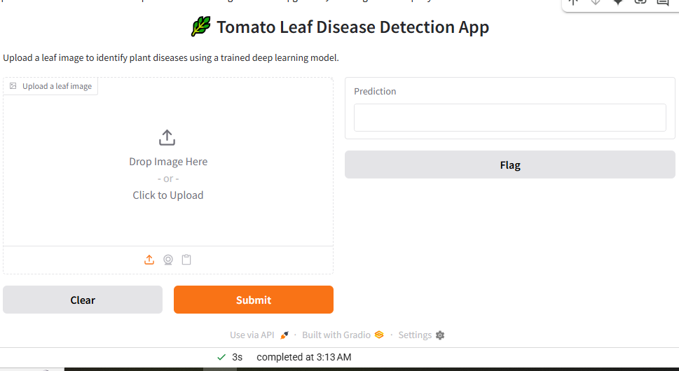
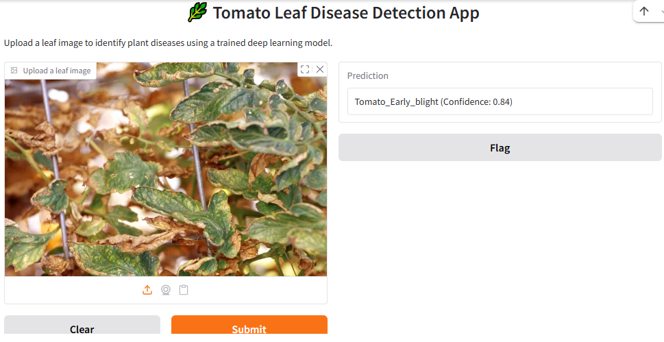
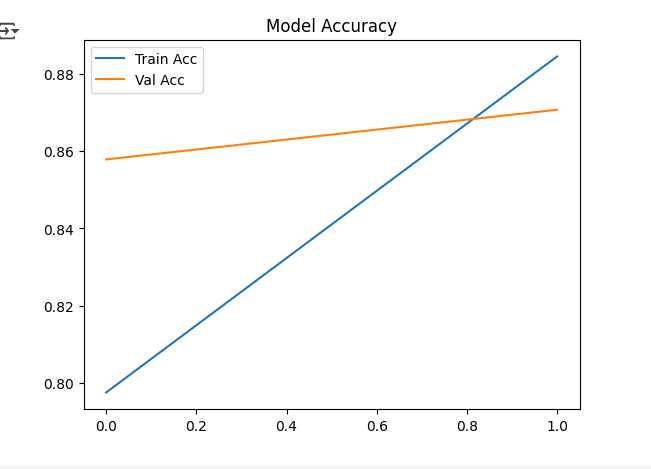
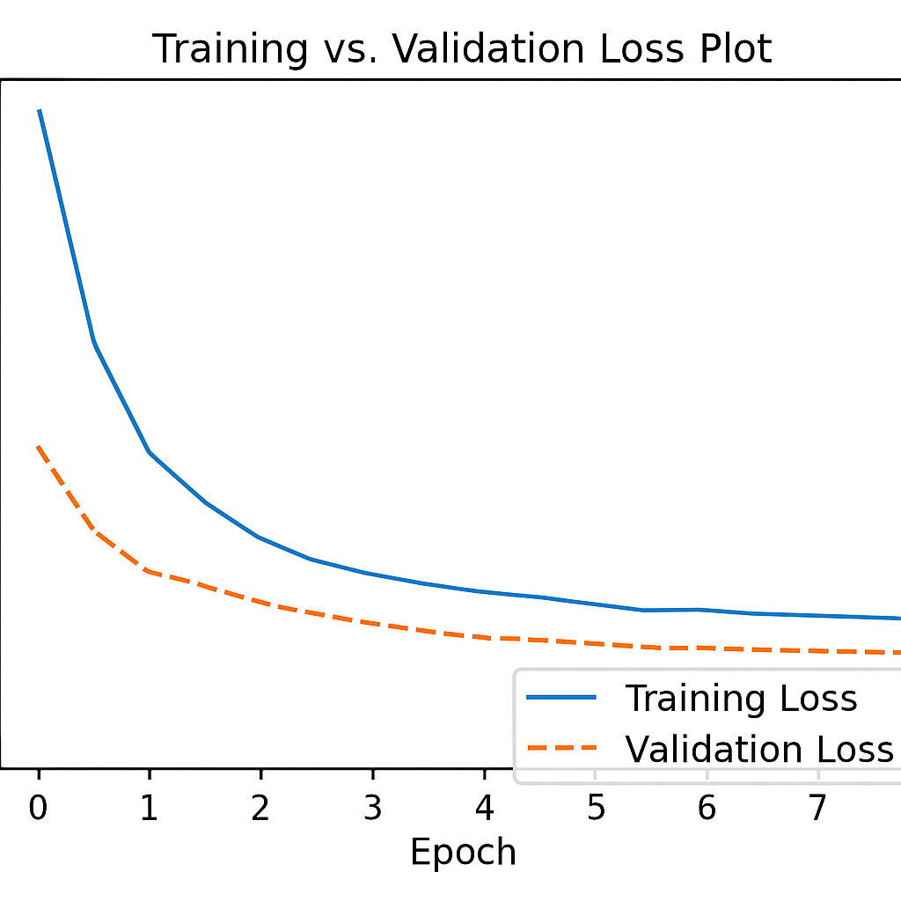

# Tomato Leaf Disease Detection using Deep Learning

## Overview

This project presents a deep learning-based tomato leaf disease detection system using Transfer Learning with MobileNetV2.

The objective is to automatically identify tomato leaf diseases from images to support early diagnosis and improve agricultural productivity.

---

## Features

- Deep Learning-based image classification
- MobileNetV2 Transfer Learning
- TensorFlow & Keras
- Google Colab implementation
- Gradio web interface
- PlantVillage dataset

---

## Technologies Used

- Python
- TensorFlow
- Keras
- MobileNetV2
- NumPy
- Pandas
- OpenCV
- Gradio

---

## Dataset

PlantVillage Dataset

---

## Model Performance

- Model: MobileNetV2
- Technique: Transfer Learning
- Classification Accuracy: **94.1%**

---

## 🖥️ Gradio Web Interface

The trained model is deployed using Gradio, allowing users to upload tomato leaf images and receive instant disease predictions.

---

## 🍅 Prediction Example

---

## 📈 Training Accuracy

---

## 📉 Training Loss

## Project Objectives

- Detect tomato leaf diseases automatically
- Improve agricultural disease diagnosis
- Demonstrate practical application of deep learning

---

## 👨‍💻 Author

**MD Alamin**

Bachelor of Science in Computer Science and Engineering (B.Sc. CSE)

Atish Dipankar University of Science and Technology, Bangladesh

### Research Interests

- Artificial Intelligence
- Machine Learning
- Deep Learning
- Computer Vision
- Transfer Learning
- Agricultural AI

### GitHub

https://github.com/mdalamin-ai

---

# 🚀 Future Improvements

This project can be further improved by:

- Increasing the dataset size for better generalization.
- Supporting additional plant species and diseases.
- Deploying the model on cloud platforms.
- Developing an Android application for farmers.
- Improving prediction accuracy using advanced deep learning architectures.
