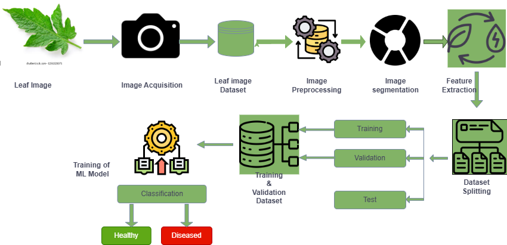
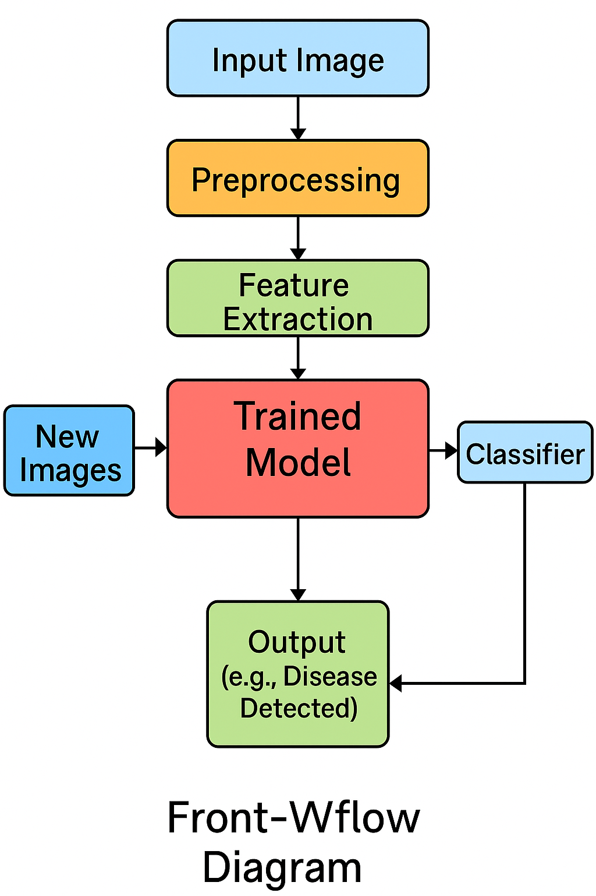

# Tomato Leaf Disease Detection using Deep Learning


## Overview

This project presents a deep learning-based tomato leaf disease detection system using Transfer Learning with MobileNetV2.

The objective is to automatically identify tomato leaf diseases from images to support early diagnosis and improve agricultural productivity.

---

## Features

- Deep Learning-based image classification
- MobileNetV2 Transfer Learning
- TensorFlow & Keras
- Google Colab implementation
- Gradio web interface
- PlantVillage dataset

---

## Technologies Used

- Python
- TensorFlow
- Keras
- MobileNetV2
- NumPy
- Pandas
- OpenCV
- Gradio

---

## 📂 Dataset

This project uses the **PlantVillage Dataset**, one of the most widely used benchmark datasets for plant disease classification.

### Dataset Information

- **Dataset Name:** PlantVillage
- **Crop:** Tomato
- **Number of Classes:** 10
- **Image Type:** RGB Leaf Images
- **Task:** Multi-class Image Classification

The dataset contains healthy and diseased tomato leaf images used to train and evaluate the deep learning model.
---

## Model Performance

- Model: MobileNetV2
- Technique: Transfer Learning
- Classification Accuracy: **94.1%**

---

## 🖥️ Gradio Web Interface

The trained model is deployed using Gradio, allowing users to upload tomato leaf images and receive instant disease predictions.


---

## 🍅 Prediction Example


---

## 📈 Training Accuracy


---

## 📉 Training Loss


---

## 🏗️ System Architecture

The overall architecture of the proposed deep learning system based on Transfer Learning using MobileNetV2.



---

## 🔄 Workflow Diagram

The workflow demonstrates the complete pipeline from image input to disease prediction.



---

## Project Objectives

- Detect tomato leaf diseases automatically
- Improve agricultural disease diagnosis
- Demonstrate practical application of deep learning

---

## 👨‍💻 Author

**MD Alamin**

Bachelor of Science in Computer Science and Engineering (B.Sc. CSE)

Atish Dipankar University of Science and Technology, Bangladesh

### Research Interests

- Artificial Intelligence
- Machine Learning
- Deep Learning
- Computer Vision
- Transfer Learning
- Agricultural AI

### GitHub

https://github.com/mdalamin-ai

---

---

# ⚙️ Installation

Clone this repository:

```bash
git clone https://github.com/mdalamin-ai/Tomato-Leaf-Disease-Detection.git
```

Navigate to the project directory:

```bash
cd Tomato-Leaf-Disease-Detection
```

Install the required libraries:

```bash
pip install -r requirements.txt
```

Launch the Jupyter Notebook or Google Colab notebook to train or evaluate the model.
---

---

# 📁 Project Structure

```text
Tomato-Leaf-Disease-Detection/
│
├── images/
│   ├── gradio-app-interface.PNG
│   ├── prediction-example-leaf.PNG
│   ├── system-architecture-flowchart.png
│   ├── training-accuracy.PNG
│   ├── training-loss.png
│   └── workflow-diagram.png
│
├── notebook/
│   ├── README.md
│   └── Tomato_Leaf_Disease_Detection.ipynb
│
├── .gitignore
├── LICENSE
├── README.md
└── requirements.txt
```

---

# 🎓 Research Contribution

This project was completed as part of my **Bachelor of Science in Computer Science and Engineering (B.Sc. CSE)** thesis at **Atish Dipankar University of Science and Technology, Bangladesh**.

### Thesis Title

**Tomato Leaf Disease Detection Using Deep Learning**

### Research Objectives

- Develop an automated tomato leaf disease detection system.
- Apply Transfer Learning using MobileNetV2.
- Evaluate model performance on the PlantVillage dataset.
- Build a user-friendly disease prediction interface using Gradio.

# 🚀 Future Improvements

This project can be further improved by:

- Increasing the dataset size for better generalization.
- Supporting additional plant species and diseases.
- Deploying the model on cloud platforms.
- Developing an Android application for farmers.
- Improving prediction accuracy using advanced deep learning architectures.
